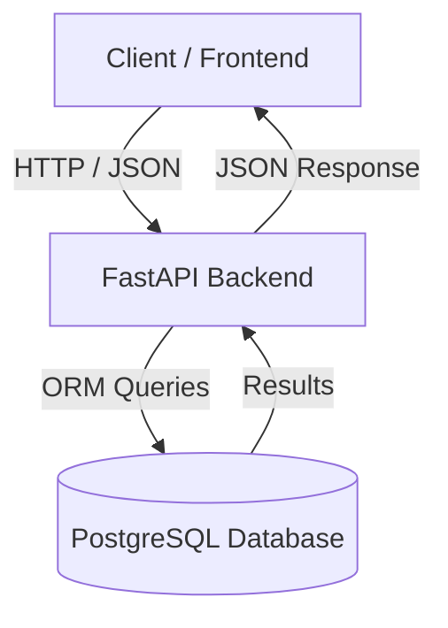

# 🧠 SkillProof Backend

**SkillProof** is a **verified skill-based portfolio backend** built using **FastAPI** and **PostgreSQL**.

Unlike traditional portfolio systems where users self-declare skills, SkillProof verifies skills through assessments.  
Only **passed skills** are publicly visible, creating a **trust-based developer portfolio**.

This repository contains the **complete backend architecture** for SkillProof.

---

## 🚀 Tech Stack

- FastAPI – High-performance Python web framework  
- PostgreSQL – Relational database  
- SQLAlchemy ORM – Database modeling & queries  
- JWT (OAuth2) – Authentication & authorization  
- Pydantic – Request & response validation  
- Uvicorn – ASGI server  

---

## 🏗️ System Architecture Overview

### High-Level Architecture



---

### Backend Layered Architecture

```
┌───────────────────────────┐
│        Client Layer        │
│   (React / API Consumer)   │
└─────────────▲─────────────┘
              │
┌─────────────┴─────────────┐
│        API Routes          │
│  auth | users | projects  │
│  skills | portfolio        │
└─────────────▲─────────────┘
              │
┌─────────────┴─────────────┐
│     Business Logic Layer   │
│  Auth | Assessment | Rules │
└─────────────▲─────────────┘
              │
┌─────────────┴─────────────┐
│      Data Access Layer     │
│     SQLAlchemy Models      │
└─────────────▲─────────────┘
              │
┌─────────────┴─────────────┐
│        PostgreSQL DB       │
└───────────────────────────┘
```

---

## 📁 Project Structure

```
backend/
├── app/
│   ├── main.py
│   ├── database/
│   │   └── pg_db.py
│   ├── models/
│   │   ├── user.py
│   │   ├── project.py
│   │   ├── skill.py
│   │   ├── question.py
│   │   ├── user_skill.py
│   │   └── user_skill_attempt.py
│   ├── schemas/
│   │   ├── user.py
│   │   ├── project.py
│   │   ├── skill.py
│   │   └── portfolio.py
│   ├── routes/
│   │   ├── auth.py
│   │   ├── user.py
│   │   ├── project.py
│   │   ├── skill.py
│   │   └── portfolio.py
│   └── routes/deps.py
├── requirements.txt
└── README.md
```

---

## 🔐 Authentication & Authorization

- JWT-based authentication
- OAuth2 password flow
- Secure password hashing
- Protected routes via dependency injection
- Public and private endpoint separation

### Core Endpoints

```
POST /auth/register
POST /auth/login
GET  /users/me
```

---

## 📁 Projects Module

```
POST   /projects
GET    /projects/me
PUT    /projects/{id}
DELETE /projects/{id}
```

- User-owned CRUD operations
- JWT protected
- No cross-user access

---

## 🧠 Skill Assessment Engine

- MCQ-based assessments
- Server-side score calculation
- Passing threshold enforcement
- Cooldown to prevent spam
- Best score preservation
- Full attempt history

### Endpoints

```
GET  /skills
GET  /skills/{skill_id}/questions
POST /skills/{skill_id}/submit
GET  /skills/history
GET  /skills/passed
```

---

## 🌍 Public Portfolio

```
GET /portfolio/{username}
```

Returns:
- Username
- Email
- Projects
- **Only verified (passed) skills**

Public, read-only endpoint.

---

## 🧪 Run Locally

```bash
python3 -m venv venv
source venv/bin/activate
pip install -r requirements.txt
uvicorn app.main:app --reload
```

---

## 📄 License

MIT License

---

## ✨ Author

**Pradeep Verma**  
Backend Engineer | FastAPI | System Design

---

## 🏁 Project Status

Backend MVP **COMPLETE**  
Production-ready backend architecture